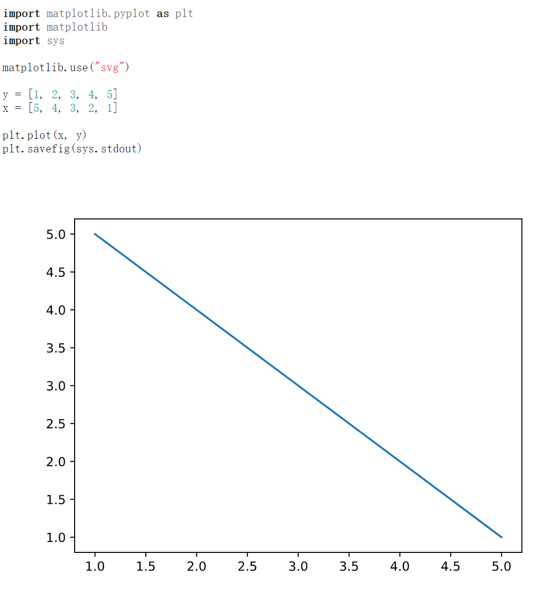

# goldmark-python

[](https://gitee.com/OhYee/goldmark-python) [](https://github.com/OhYee/goldmark-python/actions) [](https://codecov.io/gh/OhYee/goldmark-python) [](https://github.com/OhYee/goldmark-python/tags)

goldmark-python is an extension for [goldmark](https://github.com/yuin/goldmark).  

You can use python to build svg image or output data in your markdown like [mume](https://github.com/shd101wyy/mume)

## screenshot

There are two demo(using `'` instead of &#8242; in the code block)

1. default config

[Demo1](demo/demo1/main.go)
[Output1](demo/demo1/output.html)

```markdown
'''python
print("Hello World")
'''
```


2. using `python-output` and [goldmark-highlighting extension](https://github.com/yuin/goldmark-highlighting)

[Demo2](demo/demo1/main.go)
[Output2](demo/demo1/output.html)

```markdown
'''python
import matplotlib.pyplot as plt
import matplotlib
import sys

matplotlib.use("svg")

y = [1, 2, 3, 4, 5]
x = [5, 4, 3, 2, 1]

plt.plot(x, y)
plt.savefig(sys.stdout)
'''

'''python-output
import matplotlib.pyplot as plt
import matplotlib
import sys

matplotlib.use("svg")

y = [1, 2, 3, 4, 5]
x = [5, 4, 3, 2, 1]

plt.plot(x, y)
plt.savefig(sys.stdout)
'''
```



## Installation

```bash
go get -u github.com/OhYee/goldmark-python
```

## License

[MIT](LICENSE)
